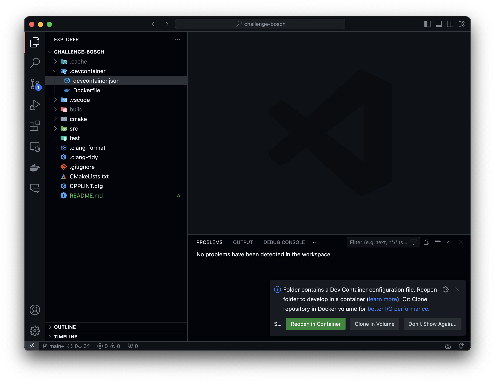
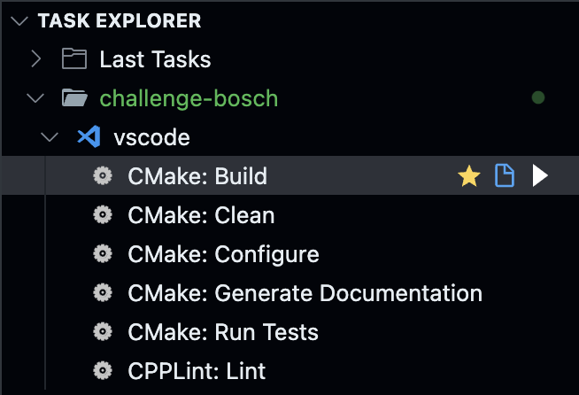
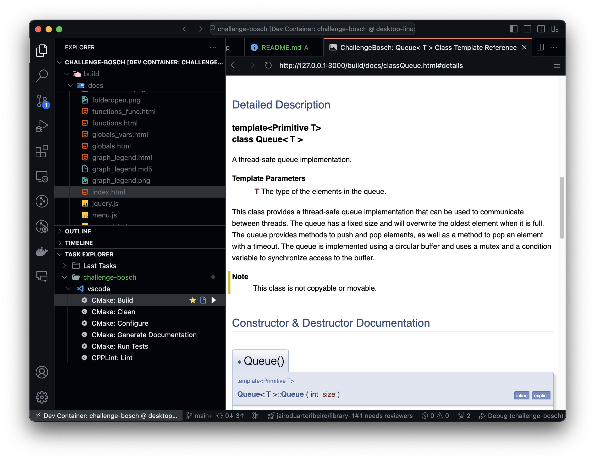
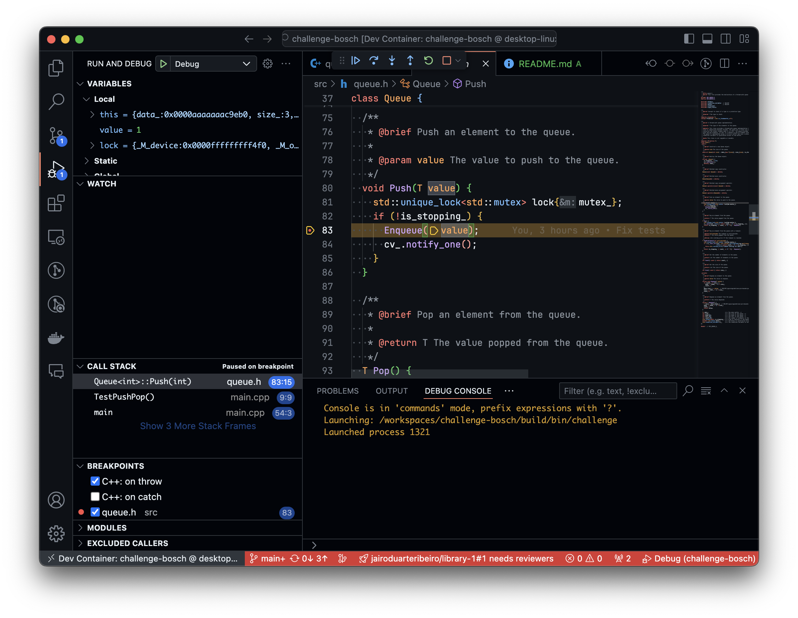

# challenge-bosch

This project implements a synchronized queue using modern C++ and CMake. It is designed to be easily accessible and reproducible using VSCode, Docker, and DevContainers. The project includes all necessary dependencies and settings for building, testing, and debugging.

## Table of Contents

- [challenge-bosch](#challenge-bosch)
  - [Table of Contents](#table-of-contents)
  - [Getting Started](#getting-started)
    - [Prerequisites](#prerequisites)
    - [DevContainer Setup](#devcontainer-setup)
  - [Project Structure](#project-structure)
  - [Tasks and Shortcuts](#tasks-and-shortcuts)
  - [Development Environment](#development-environment)
    - [Code Formatting and Linting](#code-formatting-and-linting)
    - [Extensions](#extensions)
  - [Building and Testing](#building-and-testing)
  - [Documentation](#documentation)
  - [Debugging](#debugging)

## Getting Started

### Prerequisites

To work with this project, you need:

- [VSCode](https://code.visualstudio.com/)
- [Docker](https://www.docker.com/) and the Docker extension for VSCode
- The [DevContainers extension](https://marketplace.visualstudio.com/items?itemName=ms-vscode-remote.remote-containers)

Once these tools are installed, simply clone this repository, and when you open the folder in VSCode, it will prompt you to reopen the project in the DevContainer.

```bash
git clone https://github.com/your-username/challenge-bosch.git
cd challenge-bosch
```



### DevContainer Setup

This project is designed to run inside a DevContainer. The container uses a Docker image called `llvm-cmake-ninja`, which is based on **Ubuntu 22.04** and includes the following tools:

- LLVM toolchain
- CMake
- Ninja build system

When you open the project inside VSCode, the DevContainer will be automatically set up, pulling the necessary Docker image and installing all dependencies.

## Project Structure

```plaintext
.
├── src/                # Source files
├── test/               # Unit tests
├── build/
│   └── docs/           # Documentation generated by Doxygen
├── .devcontainer/      # DevContainer configuration files
├── .vscode/
│   ├── tasks.json      # Predefined tasks (build, test, docs)
│   └── launch.json     # Debugging configuration
├── CMakeLists.txt      # CMake build configuration
└── README.md           # Project README file
```

## Tasks and Shortcuts

Several tasks have been pre-configured for ease of use, available through VSCode’s Task Explorer:

- **Configure and Build**: Configures and builds the project using CMake and Ninja.
- **Run Unit Tests**: Runs the unit tests in the `test/` folder.
- **Cleanup**: Removes generated files (e.g., build artifacts).
- **Generate Documentation**: Generates HTML documentation using Doxygen.
- **Run cpplint**: Runs cpplint for static code analysis.

To run the tasks, simply open the Task Explorer extension (left-bottom area in VSCode), or use the keyboard shortcuts provided by VSCode.

## Development Environment

### Code Formatting and Linting

The DevContainer includes several extensions and settings to ensure code quality:

- **Clangd Extension**: Provides features like code completion, in-line diagnostics, and formatting.
- **clang-format**: Code is formatted automatically on save following the **Google Style Guide**.
- **clang-tidy**: Performs static analysis to identify potential issues in your code.

### Extensions

In addition to **clangd**, the DevContainer includes:

- **Task Explorer**: For managing and running the predefined tasks.
- **Live Preview**: Allows you to preview the generated HTML documentation within VSCode.

## Building and Testing

1. Open the Command Palette (`Ctrl+Shift+P`) and run the task `Configure and Build Project`.
2. To run unit tests, use the task `Run Unit Tests`.
3. You can clean up build files using the `Cleanup Project` task.

All these tasks are accessible through the Task Explorer UI.

<p align="center">
  
</p>

## Documentation

To generate the project documentation, run the `Generate Documentation` task. This uses **Doxygen** to create HTML files that can be viewed inside VSCode with the **Live Preview** extension.

- Generated documentation is stored in the `build/docs/` folder.
- You can open the documentation directly in VSCode using the Live Preview extension.



## Debugging

The project is pre-configured to be debugged using **LLDB**. The `launch.json` configuration is set up for easy debugging directly from VSCode. You can set breakpoints, inspect variables, and step through the code.

To start debugging:

1. Open the Command Palette (`Ctrl+Shift+P`).
2. Select `Start Debugging`.
3. The debugger will use LLDB as configured in the `launch.json`.


